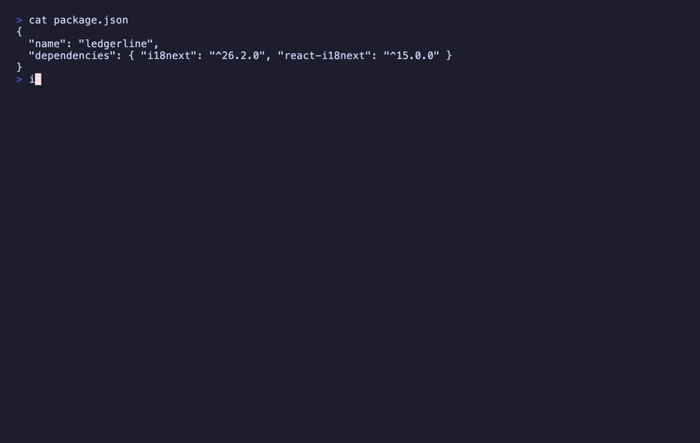

<p align="center">
  
</p>
<h1 align="center">i18n-LE: The Locale That Only Looks Finished</h1>
<p align="center">
  <b>Audit translation catalogues against the source locale, in one keystroke</b><br/>
  <i>i18next, next-intl, VS Code bundles and Flutter ARB — keys and tokens, never a translated string</i>
</p>

<p align="center">
  <a href="https://marketplace.visualstudio.com/items?itemName=nolindnaidoo.i18n-le">
    
  </a>
  <a href="https://open-vsx.org/extension/nolindnaidoo/i18n-le">
    
  </a>
  <a href="https://www.npmjs.com/package/i18n-le-mcp">
    
  </a>
  <a href="https://crates.io/crates/i18n-le">
    
  </a>
  <a href="https://letools.dev/tools/i18n-le">
    
  </a>
</p>

---

> **Useful?** A star or rating is how other developers find it —
> [★ GitHub](https://github.com/nolindnaidoo/i18n-le) ·
> [★ Open VSX](https://open-vsx.org/extension/nolindnaidoo/i18n-le/reviews) ·
> [★ Marketplace](https://marketplace.visualstudio.com/items?itemName=nolindnaidoo.i18n-le&ssr=false#review-details)

## What it does

Spanish shipped last week and the metrics screen has said `{{periodo}}` to every user since. The catalogue had every key. It parsed. The placeholder came back from machine translation with its name translated too, which compiles perfectly and renders the literal.

Open a catalogue, press `Ctrl+Alt+L` (`Cmd+Alt+L` on Mac), and the set it belongs to is audited against the source locale: keys a locale is missing or has too many of, placeholders dropped or renamed in translation, constructs from another library's convention, values left empty, keys defined twice, and a path that is an object in one locale and a string in another. The report opens beside the editor. From the Explorer, run it on any folder. Works in VS Code and in VS Code–based editors like Cursor and VSCodium (installable from Open VSX).

- **Before a release** — is this locale shippable, or does it only look like it is?
- **After machine translation** — `{{timeframe}}` that came back as `{{periodo}}`, caught by its token names
- **Reviewing a translator's pull request** — the keys that changed shape, without reading the translations

**The report never contains a translated string.** It names keys, placeholder tokens, counts and shapes; an untranslated string is proved by being byte-identical to the source, not by being shown. **It rewrites nothing.**

## Install

| Where | What you get | Install |
|---|---|---|
| **VS Code** | The audit, in your editor, on a keystroke | [Marketplace](https://marketplace.visualstudio.com/items?itemName=nolindnaidoo.i18n-le) |
| **Cursor, VSCodium, Windsurf** | The same extension | [Open VSX](https://open-vsx.org/extension/nolindnaidoo/i18n-le) |
| **A terminal or a CI step** | The same audit, with an exit code | `cargo install i18n-le` · [crates.io](https://crates.io/crates/i18n-le) |
| **Any MCP agent, via Node** | `check_catalogues` over stdio | `npx i18n-le-mcp` · [npm](https://www.npmjs.com/package/i18n-le-mcp) |
| **Zed** | The MCP server as a context server | [add it by hand](https://zed.dev/docs/ai/mcp) *(no listing yet)* |

## It works out which library you use first

`{name}` is a placeholder in next-intl and literal text in i18next; `{{ name }}` is an i18next variable and an ICU literal brace around a word. No amount of looking at the bytes settles that, so **the library is identified before a catalogue is read**, and the placeholder grammar, the plural model and which keys are metadata all come from the answer.

Five kinds of evidence, and two agreeing is an identification: a manifest dependency (`package.json`, `pubspec.yaml`), a config file, the directory layout, the catalogue's own syntax, and call sites in source. An ARB file's `@@locale` beside `@key` metadata settles it alone. **When nothing agrees, or two libraries do, it refuses and names what it found** rather than picking one. Set `i18n-le.library` to skip identification.

| Library | Placeholders | Plurals | Layouts |
|---|---|---|---|
| `i18next` | `{{name}}`, `$t(key)` nesting | `key_one` / `key_other` suffixes | `locales/<locale>.json`, `locales/<locale>/<namespace>.json` |
| `next-intl` | ICU `{name}`, `{count, plural, …}` | inside the message | `messages/<locale>.json` |
| `vscode-l10n` | `{0}` | none | `l10n/bundle.l10n.<locale>.json`, `package.nls.<locale>.json` |
| `flutter-arb` | ICU, with `@key` metadata | inside the message | `<prefix>_<locale>.arb` |

A VS Code extension's `package.nls.json` sits at the root while its translations live elsewhere; that split is read as one set. Source files are read only to answer which library this is, never for a finding.

## What it finds

| Kind | Severity | What |
|---|---|---|
| `missing-key` | error | In the source, absent from the target |
| `extra-key` | error | In the target, absent from the source |
| `placeholder-count-mismatch` | error | A placeholder was dropped or added |
| `placeholder-name-mismatch` | error | Same count, different names — `{{timeframe}}` came back as `{{periodo}}` |
| `placeholder-style-mismatch` | error | Written in a style this library does not read, where the source had a real placeholder |
| `convention-mismatch` | error | A construct from another convention — ICU, Fluent, printf, `${…}`, `$t()` — that the loader renders verbatim |
| `duplicate-key-within-file` | error | A key defined twice; every loader keeps the last |
| `structure-mismatch` | error | An object in one locale and a string in another — the one a flatten-and-compare test misses |
| `empty-value` | warning | Empty or only whitespace |
| `untranslated` | info | Byte-identical to the source |

**One catalogue is the contract, never the union of all of them** — a union would turn one translator's typo into a missing key for everyone else. It is the one English catalogue, or the one `i18n-le.source` names. Plural categories are folded onto their base key, so Polish's legitimate `_few` is not an extra key; plural-category completeness is deliberately not checked.

## Use it from an AI agent

The same engine runs as an [MCP](https://modelcontextprotocol.io) server, so an agent can call it directly instead of being handed twenty-five catalogues to diff itself.

| Editor | How |
|---|---|
| **VS Code** 1.101+ | Nothing to install — the extension registers `check_catalogues` with agent mode |
| **Zed** | No listing yet — [add the MCP server by hand](https://zed.dev/docs/ai/mcp) |
| **Claude Code** | `claude mcp add i18n-le -- npx -y i18n-le-mcp` |
| **Cursor, Windsurf, anything else** | point it at `npx i18n-le-mcp` |

```
check_catalogues(library, files, source?, keysAreSource?, maxResults?)
```

The tool takes catalogue contents and the library's name — it cannot see the project, so it cannot identify the library and does not guess. It returns the same report the editor renders, as data, capped at 500 findings by default with `meta.truncated`. It reads no files and makes no network requests. Published as [`i18n-le-mcp`](https://www.npmjs.com/package/i18n-le-mcp) on npm and as `io.github.nolindnaidoo/i18n-le` in the [MCP registry](https://registry.modelcontextprotocol.io). It answers exactly as the Rust CLI's server does: one corpus runs against both, and a differential test feeds both thousands of generated catalogue sets — broken ones included, where both report the parser's own words and position — and compares every answer.

<details>
<summary><b>Configuring it by hand</b> — any host with an MCP config file</summary>

```json
{
  "mcpServers": {
    "i18n-le": {
      "command": "npx",
      "args": ["-y", "i18n-le-mcp"]
    }
  }
}
```

Or install it once with `npm install -g i18n-le-mcp` and point at `i18n-le-mcp`. It needs no environment variables, no API key and no configuration of its own. To check it:

```bash
echo '{"jsonrpc":"2.0","id":1,"method":"tools/list"}' | npx -y i18n-le-mcp
```

</details>

## The CLI

The same audit runs from a terminal or a CI step: a Rust CLI in [`crate/`](crate/README.md), sharing one corpus with the extension — [`crate/fixtures/`](crate/fixtures/) — so the two can never read a catalogue differently.

<p align="center">
  
</p>

```bash
i18n-le locales/                       # the set in that directory, as one JSON report
i18n-le --system vscode-l10n l10n/     # name the library, skip identification
i18n-le --fail-on untranslated locales/
i18n-le mcp                            # the same audit over MCP on stdio
```

**Exit codes are the API** — 0 clean, 1 findings, 2 the question was malformed (no library identified, two identified, no single source). Finding no catalogues at all is 0: there is nothing to be wrong with.

## Commands

| Command | Description |
|---|---|
| `i18n-LE: Audit Catalogues` (`Ctrl+Alt+L` / `Cmd+Alt+L`) | Audit the set the active catalogue belongs to, or the folder picked in the Explorer |
| `i18n-LE: Open Settings` | Open i18n-LE settings |
| `i18n-LE: Help & Troubleshooting` | Built-in documentation |

## Settings

| Setting | Default | Description |
|---|---|---|
| `i18n-le.library` | `auto` | The library that wrote the catalogues; `auto` identifies it from the project |
| `i18n-le.source` | `""` | The catalogue every other is measured against, as a file name or a language tag; empty uses the one English catalogue |
| `i18n-le.keysAreSource` | `false` | The key is the English string, as in a VS Code `bundle.l10n.json`; the layout normally decides this |
| `i18n-le.openResultsSideBySide` | `true` | Open the report beside the current editor |
| `i18n-le.copyToClipboardEnabled` | `false` | Also copy the report to the clipboard |
| `i18n-le.notificationsLevel` | `silent` | `all` = every notification, `important` = warnings + errors, `silent` = errors only |
| `i18n-le.statusBar.enabled` | `true` | Show the status bar item |
| `i18n-le.telemetryEnabled` | `false` | Local-only event log (see Privacy) |

## Languages

Twelve languages besides English:

German · Spanish · French · Indonesian · Italian · Japanese · Korean ·
Portuguese (Brazil) · Russian · Ukrainian · Vietnamese · Chinese (Simplified)

Both halves are covered — the manifest (command titles, setting names and descriptions) and everything shown while the extension runs (notifications, the status bar and the report's headings). A refusal's reason is the engine's English, identical to the CLI's.

## Privacy & security

- **No network access.** The extension never sends data anywhere. The `telemetryEnabled` setting only writes events to a local Output Channel you can inspect (`i18n-LE`).
- **No translated value ever reaches a report, a notification or the MCP boundary.** Keys are the deliberate exception, and where a layout makes the key the English sentence, that English is shown.
- **The MCP server holds the same line.** It takes content as an argument and returns data: no filesystem access, no network calls, no telemetry. `check:mcp-bundle` fails the build if a translation reaches its stdout.
- Error notifications redact home directories and credential-shaped fragments.

## Documentation

| What | Where |
|---|---|
| What the tool is allowed to say — checks, identification, refusals, the privacy boundary | [`crate/SPEC.md`](crate/SPEC.md) |
| How the extension is built and held together — architecture, invariants, toolchain, release | [AGENTS.md](AGENTS.md) |
| How the CLI is built and held together | [`crate/AGENTS.md`](crate/AGENTS.md) |
| What changed | [CHANGELOG.md](CHANGELOG.md) · [`crate/CHANGELOG.md`](crate/CHANGELOG.md) |
| The tool's page, and the other fifteen | [letools.dev/tools/i18n-le](https://letools.dev/tools/i18n-le) |

## Performance

<!-- performance:start -->
| Input | Size | Found | Time | Rate | Scan speed |
| --- | --- | --- | --- | --- | --- |
| i18next, 25 locales | 2.83 MB | 48,000 | 92.53 ms | 518,733/sec | 30.6 MB/s |
| next-intl ICU, 2 locales | 3.59 MB | 20,000 | 47.75 ms | 418,877/sec | 75.2 MB/s |
| VS Code bundle, 12 locales | 0.91 MB | 2,004 | 19.3 ms | 103,839/sec | 46.9 MB/s |

Median of 7 runs after warmup, on Apple M5 Pro, 24 GB RAM, Node 24.3.0. Inputs are generated
by `scripts/benchmark.ts` rather than checked in, so the sizes above are
exactly what was measured. Reproduce with `bun run benchmark`.

These are machine-specific and are not asserted in CI — a benchmark that gates
a build only tells you how busy the runner was.
<!-- performance:end -->

## Testing

<!-- coverage:start -->
| Metric | Coverage |
| --- | --- |
| Statements | 89.83% |
| Branches | 82.92% |
| Functions | 95.97% |
| Lines | 92.42% |

209 test cases across 12 files, plus an integration suite that runs
in a real VS Code extension host and an end-to-end test that installs the
built `.vsix` into a clean profile.

Generated from a real run — `coverage/coverage-summary.json` and
`coverage/test-results.json` — by `scripts/coverage-readme.js`; CI fails if
this section drifts. Reproduce with `bun run test:coverage`, and the case
count is the one vitest prints.
<!-- coverage:end -->

## More from the LE family

Sixteen single-purpose tools for the work in front of every model. Each ships
a Rust CLI and an MCP server. One page: **[letools.dev](https://letools.dev)**

**Get it out**

- **[String-LE](https://letools.dev/tools/string-le)** — Extract every string in a codebase, with its position, so a person can read them
- **[Numbers-LE](https://letools.dev/tools/numbers-le)** — Extract every hardcoded number in a codebase, so a person can check them
- **[Units-LE](https://letools.dev/tools/units-le)** — Extract every quantity with its unit, normalized, and refuse the ambiguous ones by name
- **[Dates-LE](https://letools.dev/tools/dates-le)** — Extract every date and timestamp, and the exact instant each one resolves to
- **[IDs-LE](https://letools.dev/tools/ids-le)** — Extract every UUID, ULID, NanoID, ObjectId and Snowflake, and decode the time inside
- **[IPs-LE](https://letools.dev/tools/ips-le)** — Extract every IP address, CIDR block and MAC, normalized and classified by scope
- **[URLs-LE](https://letools.dev/tools/urls-le)** — Extract every URL in a codebase, with its protocol and exact position
- **[Paths-LE](https://letools.dev/tools/paths-le)** — Extract every file path in a codebase, and say whether it still points at anything
- **[Colors-LE](https://letools.dev/tools/colors-le)** — Extract every color in a codebase, and say which ones are not in your palette

**Check it**

- **[Regex-LE](https://letools.dev/tools/regex-le)** — Find every regex in a codebase, and report which can be driven into catastrophic backtracking
- **[Versions-LE](https://letools.dev/tools/versions-le)** — Find where one dependency is constrained differently across a repository's manifests
- **[i18n-LE](https://letools.dev/tools/i18n-le)** — Identify the i18n library a project uses, then audit its catalogs by that library's rules
- **[Scrape-LE](https://letools.dev/tools/scrape-le)** — Check whether a page is scrapeable before the scraper is written, and say when it cannot tell

**Guard it**

- **[Secrets-LE](https://letools.dev/tools/secrets-le)** — Find hardcoded credentials in a codebase, and never print one into the report
- **[EnvSync-LE](https://letools.dev/tools/envsync-le)** — Compare the dotenv files in a tree, and say which keys are missing from which
- **[Unicode-LE](https://letools.dev/tools/unicode-le)** — Find the Unicode that hides meaning — bidi controls, invisibles, homoglyphs, mixed scripts

Each stands on its own: no shared crate, no published core. Where two of them
agree, it is because the same answer was right twice.

**Contact** — [nolindnaidoo.com](https://nolindnaidoo.com) · [GitHub](https://github.com/nolindnaidoo) · [LinkedIn](https://www.linkedin.com/in/nolindnaidoo/)

## Also by nolindnaidoo

**Rust** — pixelcoords and pixelactions are one loop: pixelcoords answers
*where*, pixelactions *acts* there. Their own tools, their own voice — not
part of the LE family.

- **[pixelcoords](https://github.com/nolindnaidoo/pixelcoords)** — Freeze your screen, mark regions, get pixel-exact coordinates and crops
  [pixelcoords.dev](https://pixelcoords.dev) · [crates.io](https://crates.io/crates/pixelcoords) · [docs.rs](https://docs.rs/pixelcoords)
- **[pixelactions](https://github.com/nolindnaidoo/pixelactions)** — Consume human-verified coordinates, perform the interaction, confirm it landed
  [pixelactions.dev](https://pixelactions.dev) · [crates.io](https://crates.io/crates/pixelactions) · [docs.rs](https://docs.rs/pixelactions)

## License

MIT © [nolindnaidoo](https://github.com/nolindnaidoo)
